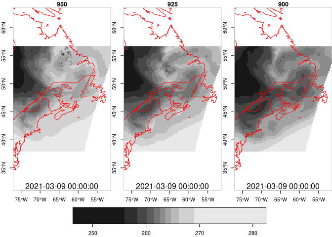
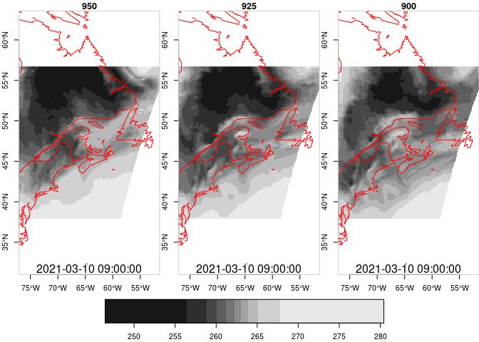

nam218grads
================

This package simplifies access to the [NCEP NOMADS grads
server](http://nomads.ncep.noaa.gov:80/dods/nam) for the
[NAM](https://www.ncdc.noaa.gov/data-access/model-data/model-datasets/north-american-mesoscale-forecast-system-nam)
forecast models.

## Requirements

-   [R v4+](https://www.r-project.org/)
-   [rlang](https://CRAN.R-project.org/package=rlang)
-   [dplyr](https://CRAN.R-project.org/package=dplyr)
-   [sf](https://CRAN.R-project.org/package=sf)
-   [stars](https://CRAN.R-project.org/package=stars)
-   [ncdf4](https://CRAN.R-project.org/package=ncdf4)

## Installation

    remotes::install_github("BigelowLab/nam218grads")

## Usage

### Retrieve a URL for a resource

Retrieve a URL for a resource by date, like yesterday’s forecast at
0000H. Note that the NCEP/NOMADS grads server only maintains the current
forecast plus the prior 6.

``` r
library(stars)
library(nam218grads)
uri <- grads_uri(date = Sys.Date()-1, product = "nam_00z")
uri
```

    ## [1] "http://nomads.ncep.noaa.gov:80/dods/nam/nam20210304/nam_00z"

### Get a handle to a resource

It’s just a [ncdf4](https://CRAN.R-project.org/package=ncdf4) object,
but we wrapped common tasks in friendly functions.

``` r
x <- open_grads(uri)
# File http://nomads.ncep.noaa.gov:80/dods/nam/nam20210303/nam_00z (NC_FORMAT_CLASSIC):
# 
#      141 variables (excluding dimension variables):
#         float absvprs[lon,lat,lev,time]   
#             _FillValue: 9.99900026055401e+20
#             missing_value: 9.99900026055401e+20
#             long_name: ** (1000 850 700 500 250) absolute vorticity [1/s] 
#         float no4lftx180_0mb[lon,lat,time]   
#             _FillValue: 9.99900026055401e+20
#             missing_value: 9.99900026055401e+20
#             long_name: ** 180-0 mb above ground best (4 layer) lifted index [k] 
#      ...
#    4 global attributes:
#        title: NAM every 3 hours fcst staring from 00Z03mar2021, download Mar 03 02:38 UTC
#        Conventions: COARDS GrADS
#        dataType: Grid
#        history: Wed Mar 03 22:27:39 GMT 2021 : imported by GrADS Data Server 2.0
```

You can explore the contents of the resource.

``` r
times <- get_time(x)
times
```

    ##  [1] "2021-03-06 00:00:00 UTC" "2021-03-06 03:00:00 UTC"
    ##  [3] "2021-03-06 06:00:00 UTC" "2021-03-06 09:00:00 UTC"
    ##  [5] "2021-03-06 12:00:00 UTC" "2021-03-06 15:00:00 UTC"
    ##  [7] "2021-03-06 18:00:00 UTC" "2021-03-06 21:00:00 UTC"
    ##  [9] "2021-03-07 00:00:00 UTC" "2021-03-07 03:00:00 UTC"
    ## [11] "2021-03-07 06:00:00 UTC" "2021-03-07 09:00:00 UTC"
    ## [13] "2021-03-07 12:00:00 UTC" "2021-03-07 15:00:00 UTC"
    ## [15] "2021-03-07 18:00:00 UTC" "2021-03-07 21:00:00 UTC"
    ## [17] "2021-03-08 00:00:00 UTC" "2021-03-08 03:00:00 UTC"
    ## [19] "2021-03-08 06:00:00 UTC" "2021-03-08 09:00:00 UTC"
    ## [21] "2021-03-08 12:00:00 UTC" "2021-03-08 15:00:00 UTC"
    ## [23] "2021-03-08 18:00:00 UTC" "2021-03-08 21:00:00 UTC"
    ## [25] "2021-03-09 00:00:00 UTC" "2021-03-09 03:00:00 UTC"
    ## [27] "2021-03-09 06:00:00 UTC" "2021-03-09 09:00:00 UTC"
    ## [29] "2021-03-09 12:00:00 UTC"

``` r
levels <- get_lev(x)
levels
```

    ##  [1] 1000  975  950  925  900  875  850  825  800  775  750  725  700  675  650
    ## [16]  625  600  575  550  525  500  475  450  425  400  375  350  325  300  275
    ## [31]  250  225  200  175  150  125  100   75   50   20   10    5

``` r
vars <- get_varnames(x)
vars
```

    ##   [1] "absvprs"        "no4lftx180_0mb" "acpcpsfc"       "albdosfc"      
    ##   [5] "apcpsfc"        "bmixlhy1"       "capesfc"        "cape180_0mb"   
    ##   [9] "cdsfc"          "cfrzrsfc"       "cicepsfc"       "cinsfc"        
    ##  [13] "cin180_0mb"     "cnwatsfc"       "crainsfc"       "csnowsfc"      
    ##  [17] "dlwrfsfc"       "dpt2m"          "dswrfsfc"       "dzdtprs"       
    ##  [21] "fricvsfc"       "gustsfc"        "hgtsfc"         "hgtprs"        
    ##  [25] "hgtclb"         "hgtpbl"         "hgtlwb0"        "hgt0c"         
    ##  [29] "hindexsfc"      "hlcy3000_0m"    "hpblsfc"        "icecsfc"       
    ##  [33] "landsfc"        "lftxl100_100"   "lhtflsfc"       "ltngsfc"       
    ##  [37] "maxrh2m"        "maxuw10m"       "maxvw10m"       "minrh2m"       
    ##  [41] "msletmsl"       "mstav0_100cm"   "pli30_0mb"      "porossfc"      
    ##  [45] "pressfc"        "pres80m"        "presmwl"        "prestrop"      
    ##  [49] "prmslmsl"       "pwatclm"        "refcclm"        "refd4000m"     
    ##  [53] "refd1000m"      "refdhy1"        "retopclm"       "rhprs"         
    ##  [57] "rh2m"           "rhsg330_1000"   "rh30_0mb"       "rh60_30mb"     
    ##  [61] "rh90_60mb"      "rh120_90mb"     "rh150_120mb"    "rh180_150mb"   
    ##  [65] "rh0c"           "rlyrssfc"       "sfcrsfc"        "shtflsfc"      
    ##  [69] "smdrysfc"       "smrefsfc"       "snodsfc"        "snowcsfc"      
    ##  [73] "soill0_10cm"    "soill10_40cm"   "soill40_100cm"  "soill100_200cm"
    ##  [77] "soilm0_200cm"   "soilw0_10cm"    "soilw10_40cm"   "soilw40_100cm" 
    ##  [81] "soilw100_200cm" "sotypsfc"       "spfh2m"         "spfh80m"       
    ##  [85] "tcdcclm"        "tkeprs"         "tmax2m"         "tmin2m"        
    ##  [89] "tmpsfc"         "tmpprs"         "tmp2m"          "tmp80m"        
    ##  [93] "tmp30_0mb"      "tmp60_30mb"     "tmp90_60mb"     "tmp120_90mb"   
    ##  [97] "tmp150_120mb"   "tmp180_150mb"   "tmptrop"        "tsoil0_10cm"   
    ## [101] "tsoil10_40cm"   "tsoil40_100cm"  "tsoil100_200cm" "tsoil300cm"    
    ## [105] "ugrdprs"        "ugrd10m"        "ugrd80m"        "ugrd30_0mb"    
    ## [109] "ugrd60_30mb"    "ugrd90_60mb"    "ugrd120_90mb"   "ugrd150_120mb" 
    ## [113] "ugrd180_150mb"  "ugrdpbl"        "ugrdmwl"        "ugrdtrop"      
    ## [117] "ulwrfsfc"       "uswrfsfc"       "vegsfc"         "vgrdprs"       
    ## [121] "vgrd10m"        "vgrd80m"        "vgrd30_0mb"     "vgrd60_30mb"   
    ## [125] "vgrd90_60mb"    "vgrd120_90mb"   "vgrd150_120mb"  "vgrd180_150mb" 
    ## [129] "vgrdpbl"        "vgrdmwl"        "vgrdtrop"       "vgtypsfc"      
    ## [133] "vissfc"         "visclt"         "vratepbl"       "vucsh0_6000m"  
    ## [137] "vvcsh0_6000m"   "vvelprs"        "weasdaccsfc"    "weasdsfc"      
    ## [141] "wiltsfc"

``` r
dims <- get_dims(x)
dims
```

    ##  lat  lev  lon time 
    ##  443   42  913   29

### Retrieve data

#### As an array

Retrieving data will return contiguous arrays of data. We provide a
function `get_var_array` that expects the slab coordinates in integer
run-length encoding for each dimension as `[start_index, count]`. This
function returns an array of cell values - for range of pressure levels
at different times.

``` r
a <- nam218grads::get_var_array(x, "tmpprs", 
                                list(lon = c(110, 100),
                                     lat = c(150, 75),
                                     lev = c(3, 5),
                                     time = c(1, 12)))
str(a)
```

    ##  num [1:100, 1:75, 1:5, 1:12] NA NA NA NA NA NA NA NA NA NA ...

#### As a stars object

The `get_var` function is a convenient wrapper around the
`get_var_array` function. Users specify the slab limits with ‘real
world’ units, and a [`stars`](https://r-spatial.github.io/stars/) object
is returned (although returning an array is an option).

``` r
s <- nam218grads::get_var(x, "tmpprs",
                          bb = c(-77.0, -51.5, 37.9, 56.7),
                          time = times[1:12],
                          lev = levels[3:5])
s
```

    ## stars object with 4 dimensions and 1 attribute
    ## attribute(s), summary of first 1e+05 cells:
    ##     tmpprs      
    ##  Min.   :244.4  
    ##  1st Qu.:259.0  
    ##  Median :265.1  
    ##  Mean   :265.1  
    ##  3rd Qu.:271.9  
    ##  Max.   :283.7  
    ##  NA's   :11260  
    ## dimension(s):
    ##      from  to         offset     delta  refsys point values x/y
    ## x       1 226       -77.0816  0.113384  WGS 84    NA   NULL [x]
    ## y       1 170        56.7171 -0.110827  WGS 84    NA   NULL [y]
    ## z       1   3            950       -25      NA    NA   NULL    
    ## time    1  12 2021-03-06 UTC   3 hours POSIXct    NA   NULL

You can also retrieve multiple variables. Note in the example below that
`ugrd10m` and `vgrd10m` (wind component speeds at 10m above surface) do
not have a `lev` dimension so we can ignore the `lev` argument.

``` r
winds <- nam218grads::get_var(x, c("ugrd10m", "vgrd10m"),
                          bb = c(-77.0, -51.5, 37.9, 56.7),
                          time = times[5:7])
winds
```

    ## stars object with 3 dimensions and 2 attributes
    ## attribute(s):
    ##     ugrd10m           vgrd10m       
    ##  Min.   :-17.983   Min.   :-13.765  
    ##  1st Qu.:  3.370   1st Qu.: -4.543  
    ##  Median :  5.866   Median : -2.550  
    ##  Mean   :  4.605   Mean   : -1.180  
    ##  3rd Qu.:  8.369   3rd Qu.:  1.776  
    ##  Max.   : 21.627   Max.   : 14.740  
    ##  NA's   :14664     NA's   :14664    
    ## dimension(s):
    ##      from  to                  offset     delta  refsys point values x/y
    ## x       1 226                -77.0816  0.113384  WGS 84    NA   NULL [x]
    ## y       1 170                 56.7171 -0.110827  WGS 84    NA   NULL [y]
    ## time    1   3 2021-03-06 12:00:00 UTC   3 hours POSIXct    NA   NULL

#### Close the handle

The resource is a ncdf4 object - be sure to close it when done.

``` r
close_grads(x)
```

### Plot the levels at different times

Let’s use the temperature at various pressure levels in variable `s` for
some plotting. First time slice…

``` r
if (require(maps)){
  time_string <- format(times[1], "%Y-%m-%d %H:%M:%S")
  overlay_fun <- function() {
    map(col = 'red', add = TRUE)
    mtext(time_string, side = 1, line = -1)
  }
  plot(s, axes = TRUE, hook = overlay_fun)
}
```

    ## Loading required package: maps

<!-- -->

And the last time slice…

``` r
if (require(maps)){
  time_string <- format(times[12], "%Y-%m-%d %H:%M:%S")
  plot(s[,,,,12], axes = TRUE, hook = overlay_fun)
}
```

<!-- -->
