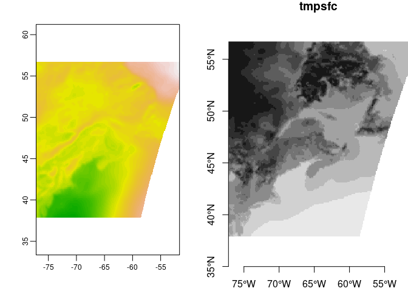
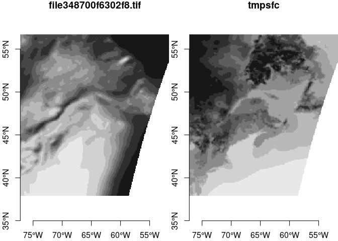

NAM218 forecast compare
================

Get a fresh forecast using the new system.

``` r
BB <- namtools::nam_bb(what = 'forecast', where = 'nwa')
uri <- grads_uri(date = Sys.Date()-1, product = "nam_00z")
x <- open_grads(uri)
New <- nam218grads::get_var(x, "tmpsfc",
                          bb = BB,
                          time = get_time(x)[1:2])[,,,1]
close_grads(x)
```

Read the last forecast captured in or old system

``` r
oldfile <- "/mnt/ecocast/coredata/nam218/nwa/fcast/day00/mean_vwind.grd"
Old <- terra::rast(oldfile)
```

What is the shape of the new? What is the resolution?

``` r
dim(New)
```

    ##    x    y time 
    ##  225  170    1

``` r
attr(New, "dimensions")[['x']]$delta
```

    ## [1] 0.1133838

``` r
attr(New, "dimensions")[['y']]$delta
```

    ## [1] -0.1108273

And the old?

``` r
dim(Old)
```

    ## [1] 171 225   1

``` r
res(Old)
```

    ## [1] 0.1134952 0.1103852

A plot…

``` r
par(mfrow = c(1,2))
plot(Old, legend = FALSE)
plot(New, key.pos = NULL, axes = TRUE)
```

<!-- -->

``` r
Rsmp <- Old %>%
  st_as_stars() %>%
  st_warp(New[,,,1], use_gdal = TRUE)
dim(Rsmp)
```

    ##   x   y 
    ## 225 170

``` r
attr(Rsmp, "dimensions")[['x']]$delta - attr(New, "dimensions")[['x']]$delta
```

    ## [1] 0

``` r
attr(Rsmp, "dimensions")[['y']]$delta - attr(New, "dimensions")[['y']]$delta
```

    ## [1] 0

``` r
par(mfrow = c(1,2))
plot(Rsmp, key.pos = NULL, axes = TRUE, reset = FALSE)
plot(New, key.pos = NULL, axes = TRUE)
```

<!-- -->

## Proposed Steps

### What to do

1)  start downloading daily forecasts from 00Z, make averages (or
    whatever) for each variable for day0, day1, day2, day3 and save.

2)  Build database organized by

Year/ Month/ Day/ date\_variable\_1.tif (“2021-03-06\_mean\_uwind.tif”)
date\_variable\_2.tif (“2021-03-06\_mean\_vwind.tif”)

3)  Convert “old” forecast data to new database, slight interpolation

4)  Fill in missing gap as best we can when OpenDAP/THREDDS is restored

### Estimated time…

(1 and 2) One or two days to get script running

3)  Week or more

4)  Who knows

### What about “NAM analyses”

Needs further study because projection is so different. But…

1)  possibly use to backfill to earlier times using interpolated grids

2)  possibly abandon in favor of just saving the forecasts
